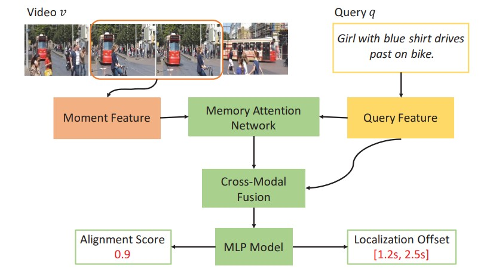
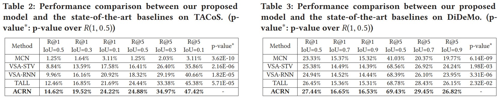

# Official Code for Attentive Moment Retrieval in Videos


## Introduction
In the past few years, language-based video retrieval has attracted a lot of attention. However, as a natural extension, localizing the specific video moments within a video given a description query is seldom explored. 
Although these two tasks look similar, the latter is more challenging due to two main reasons: 1) The former task only needs to judge whether the query occurs in a video and returns an entire video, 
but the latter is expected to judge which moment within a video matches the query and accurately returns the start and end points of the moment.  Due to the fact that different moments in a video have varying durations and diverse spatial-temporal characteristics, uncovering the underlying moments is highly challenging. 
2) As for the key component of relevance estimation, the former usually embeds a video and the query into a common space to compute the relevance score. 
However, the latter task concerns moment localization, where not only the features of a specific moment matter, but the context information of the moment also contributes a lot. 
For example, the queries may contain temporal constraint words, such as ''first'', therefore need temporal context to properly comprehend them. To address these issues, we develop an Attentive Cross-Modal Retrieval Network.

## Links

- **Paper**: [ACM SIGIR](https://arxiv.org/abs/xxxx.xxxxx)
- **Code Download**: [Baidu Netdisk](https://pan.baidu.com/s/1eUgvASi)

We also reimplemented the code for several baseline methods:
- **Code Download**: [MCN](https://github.com/LisaAnne/LocalizingMoments)
- **Code Download**: [Glove](https://pan.baidu.com/s/1htqQDla)
- **Code Download**: [TALL](https://github.com/jiyanggao/TALL)
- **Code Download**: [TALL](https://pan.baidu.com/s/1kWjsXYB)
- **Code Download**: [VSA-STV](https://pan.baidu.com/s/1eTX8hOI)
- **Code Download**: [VSA-RNN](https://pan.baidu.com/s/1mjx4eve)
  
## Method Overview

<p align="center">
  
</p>


## Results

<p align="center">
  
</p>

Our method achieves competitive or superior results compared with previous methods on multiple benchmarks.

## License

Copyright (C) 2018 Shandong University

This program is licensed under the GNU General Public License v3.0.  
You may obtain a copy of the license at:  
https://www.gnu.org/licenses/gpl-3.0.html

Any derivative work based on this program must also be licensed under the GNU General Public License as published by the Free Software Foundation, either version 3 of the License, or (at your option) any later version, if such derivative work is distributed to a third party.

The copyright of this program is owned by Shandong University.

For commercial projects that require distributing this code as part of a program that cannot be released under the GNU General Public License, please contact `mengliu.sdu@gmail.com` to obtain a commercial license.

## Citation

If you find this project useful in your research, please consider citing:

```bibtex
@inproceedings{liu2018attentive,
  title={Attentive moment retrieval in videos},
  author={Liu, Meng and Wang, Xiang and Nie, Liqiang and He, Xiangnan and Chen, Baoquan and Chua, Tat-Seng},
  booktitle={The 41st international ACM SIGIR conference on research \& development in information retrieval},
  pages={15--24},
  year={2018}
}
